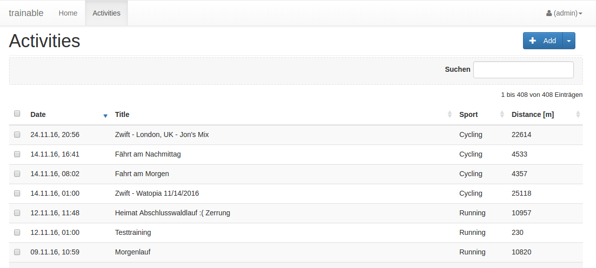
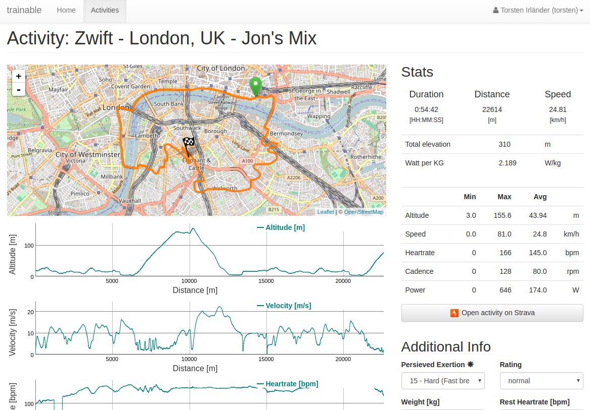

**********
Einleitung
**********
Trainable ist ein Werkzeug zu zielgerichteten Trainingsteuerung. Für die
Steuerung des Trainings werden Methodiken genutzt, die auch in agilen
Projekten erfolgeich angewendet werden.

Mit Hilfe von Trainable hälst du steht deine wichtigsten Trainingsziele im
Blick. Du kannst überprüfen, ob du entsprechend der Vorgaben aus deinem
Trainingsplan trainierst und auf einem guten Weg bist deine persönlichen Ziele
für dieses Jahr zu erreichen.

Trainable setzt viele Ideen und Konzepte aus Joe Friel´s *Trainingsbibel* und
Thomas Chapple´s *Grundlagetraining für Radsportler* um.

.. Trainable ermöglicht dir die
.. 
.. 1. **Erstellung eines Athlet's Backlog**
..    Basierend auf deinen persönlichen Zielen lässt sich ein :ref:`Traingsplan
..    <trainingsplan>` erstellen, der sicherstellt das du zum richtigen Zeitpunkt
..    in der Saison in Bestform für deine wichtigsten Wettkämpfe und
..    Herausforderungen bist.
.. 
.. 1. **Überwachen deiner Trainingsvorgaben**
..    Trainable vergleicht die Trainingseinheiten aus dem :ref:`Trainingsstagebuch <logbook>` mit den
..    Vorgaben aus dem Trainingsplan und sagt dir, wie gut du die Vorgaben
..    deines Traingsplans umsetzt. Das umfasst sowohl die Ziele der einzelnen
..    Einheiten als auch das Wochenpensum zur Vermeidung von Über- und
..    Untertraining.
.. 
.. 1. **Regelmäßige Dokumentation der Ergebnisse aus der Leistungsdiagnose**.
..    Durch die regelmäßige Dokumentation der Ergebnisse einer :ref:`Leistungsdiagnose <diagnostic>`
..    kannst du die Fortschritte während der Saison verfolgen.
.. 

.. rubric:: Was ist Trainable nicht?

Trainable ist kein Werkzeug zur detailierten Analyse von deinen einzelnen
Trainingseinheiten. Hierfür gibt es bereits eine ganze Menge von Anwendungen,
die diese Aufgabe hervorragen lösen. Vermutlich nutzt du auch bereits eines
dieser Programme. Trainable soll diese Programme nicht ersetzen sondern
ergänzen.

Agile Methoden im Training
==========================
Agile Methoden des Projektmanagement sind in der Softwareentwicklung
allgegenwärtig und nicht mehr wegzudenken. Auch in anderen Bereichen wird eine
agile Herangehensweise zunehmend angewandt. Agiles Projektmanagement
verspricht einen möglichst einfachen Prozess, der es erlaubt, flexibel auf
Änderungen reagieren, und zu jedem Zeitpunkt im Projekt den größtmöglichen
Wert herzustellen.  Flexibilität, einfaches Methoden, Risikominimierung,
maximaler Nutzen zu jedem Zeitpunkt. Das klingt auch für sein Training
sinnvoll.

Die Saison als Projekt
----------------------
Die Saison ist wie ein Projekt.

Jede Saison hat seine Ziele, die zu Beginn festgelegt werden. So könnte ein
Ziel z.B. eine bestimmte Platzierung in einem lokalen Rennen sein, oder das
Unterbieten einer Zeit auf einer Strecke. Wichtig ist jedoch, dass diese Ziele
klar messbar sind, denn an Ihnen wird der Sportler am Ende entscheiden, ob
seine Saison erfolgreich gewesen ist.

Die Saison hat einen klaren Beginn und ein definiertes Ende. In der Regel ist
das der Saisonhöhepunkt. Möglichweise gibt es auch sowas wie Meilensteine:
Kleinere Wettkämpfe in der Saison zur Ermittlung seines Trainingsstandes unter
Wettkampfbedingungen.

Der Athlet als Produkt
----------------------
In den meisten Projekten gilt es ein Produkt erstellen, welches sich dann an
den Projektzielen messen lässt. Übertragen auf den Sport heisst das nichts
anderes, als dass wir in der Saison einen Athleten aufbauen, der die
gesteckten Saisonziele möglichst gut erreichen kann.

Agiles und klassischen Training
-------------------------------
Die Planung und Steuerung des Trainings ist Gegenstand eines Trainingsplans.
Der Trainingsplan ist quasi der Projektplan für die Saison. Bei dem Aufbau des
Trainingsplans gibt es verschiedene Ansätze.

Welcher Ansatz am Ende am besten geeignet ist seine Ziele zu erreichen hängt
stark von den Umständen ab, unter denen trainiert wird. Um es mit den Worten
eines Projektmanagers zu sagen, handelt es sich dabei um eine typische
Risiko/Nutzen Abwägung.

Als Profi-Sportler, der unter optimalen Bedingungen trainiert und seine Saison
perfekt auf das eine Saisonziel hin planen kann, mag ein klassischer Ansatz
optimal sein.
Für mich als Familienvater mit einer 40 Stunden/Woche und anderen Verpflichtungen
ist die Einhaltung eines solchen Traingsplans mit dem einen großen Ziel
mindestens schwierig.

.. rubric:: Training im Wasserfall
Das ist der Klassiker. Nahezu alle traditionellen Trainingshandbücher lehren
diesen Ansatz: Das Training baut in klaren zuvor definierten Phasen
aufeinander auf. Zu Beginn steht das Grundlagentraining auf dem Programm. Mit
fortschreitender Zeit wird das Training spezifischer. Das Training baut
perfekt aufeinander auf und hat das Ziel zum Saisonhöhepunkt in Topform zu
sein. Entscheidend sind diese zwei drei Wochen Wettkampfphase. Alles ist mehr
oder minder diesem Saisonhöhepunkt untergeordnet.

.. rubric:: Agiles Training
Wendet man die Grundsätze agiler Method auf sein Training an, so würde man
das Training anders gestalten.

Hier ist es das Ziel, die für die zur Erreichung der Saisonziele
erforderlichen Fähigkeiten, möglichst früh auszubilden und zu erhalten. Die
wichtigsten Fähigkeiten zuerst. So ist das Training zu jedem Zeitpunkt auf die
konkreten Anforderungen hin optimiert. Eigentlich könnte jeder Tag der
Wettkampftag sein, und der Athlet wäre sich immer sicher, sich bestmöglich
vorbereitetet zu haben.

Wenn man das Training immer an den unmittelbar wichtigsten Leistungskaforen
ausrichtet, dann weicht der Trainingsplan in Teilen erheblich von dem
klassischen Trainingsplan ab.

Klassisch würde man den Start der Saison beim Radsport mit langen lockeren
Einheiten beginnen. Ziel ist es den Fettstoffwechsel zu trainieren, um später
auch bei höheren Belastungen anteilig mehr Energie aus dem Fettstoffwechsel zu
erhalten und so mehr Reserven für höhere Belastungen zu haben. Die Annahme ist
das ich dann insgesamt ein höheres Grundtempo fahren kann. Erst später
verschiebt sich das Training auf andere Bereiche und das Trainings wird
spezifischer auf die konkreten Anforderungen. Dabei greifen die verschieden
Einheiten perfekt ineinander mit dem Ziel zum Saisonhöhepunkt in optimaler
Form zu sein.

Gestalten man sein Training agil ist die Zielsetzung anders. In einem Rennen
fährt man nicht lange und locker, sondern hart und ggf. sehr kurz. Anforderung
ist also: Möglichst lange bei hoher Belastung fahren zu können. Entscheidend
für diese Eigenschaft ist die aerobe Schwelle - also die Leistung, die ich mit
aerober Energiegewinnung bereitstellen kann. Diese aerobe Schwelle lässt sich
auch direkt verbessern, wenn man lange schnell läuft oder Rad fährt.
Dabei läuft dann vielleicht der Fettstoffwechsel noch nicht optimal, aber den
könnte man z.B. auch später trainieren. Das Training des Fettstoffwechsel
könnte dann auch gleich mit höherer Intensität ablaufen, denn die aerobe
Schwelle haben wir ja bereits gehoben.

Entscheidend bei der Plaung eines Trainings nach agilen Methoden ist die
folgende Frage: Mit welchem Training wäre ich zu jedem Zeitpunkt in der Saison
gemessen an meinen Saisonziel der besserere Athlet.

Zielgruppe
==========
Trainable richtet sich an ambitionierte Hobby-Athleten, die aufgrund von
verschiedenen Gründen ihr Training nicht so planen können wie dies vielleicht
Profisportler tun können. Trainable soll diesen Sportlern helfen ihr Training
mit einfachen Mitteln zu optimieren.

Empfohlene Ausrüstung
=====================

.. rubric:: Rollentrainer
.. rubric:: Pulsgurt
.. rubric:: Trittfrequenzsensonsor
.. rubric:: Wattmesser
.. rubric:: Strava Account
.. rubric:: Google Account

Über den Author
===============
Mein Name ist Torsten Irländer. Ich bin leidenschaftlicher Softwareentwickler
und bringe 10 Jahre Erfahrung in der Umsetzung von Projekten mit. Ich arbeite
Vollzeit und bin glücklicher Vater einer kleinen Familie.  Zwei Umstände die
vor dem Hintergrund seines geplanten Trainings ein Risiko darstellen. 

Für mich als ambitionierter Hobbysportler sind das zu viele Umstände, die
 dafür sorgen, dass man nicht wie geplant trainieren kann. Was liegt nun näher
sein Wissen aus dem Projektmanagement und die Fähigkeiten aus der
Softwareentwicklung auch für die Steuerung seines Trainings zu nutzen, denn
wir erinnern uns: Agile Methode versprechen eine Riskominimierung indem
wir zu jedem Zeitpunkt den größtmöglichen Wert herstellen.

********************************
Athlet's Backlog (Saisonplanung)
********************************
Vereinfacht gesagt ist das Athlet's Backlog ihr Trainingsplan für die Saison.

Das Athlet's Backlog enthält die Fähigkeiten, die von einem Athleten gefordert
sind, um in der Saison erfolgreich zu sein. Die verschiedenen Fähigkeiten sind
nach den Anforderungen priorisiert, die sich aus Saisonzielen ergeben. Die
Priorisierung kann sich aber jederzeit ändern.  Im Rahmen des Trainings soll
so erreicht werden, das der Athlet die Fähigkeiten und Eigenschaften als
erstes erlangt und erhält, die für die spezifischen Saisonziele am wichtigsten
sind.

Saisonziele
===========
Die Saisonziele geben die Inhalte des Athlet's Backlog vor. Sie geben vor
welche Eigenschaften für den Athleten am wichtigsten sind. Diese Eigenschaften
nennen sich Leistungsfaktoren. Sie geben vor was trainiert werden muss. Sie
unterscheiden sich und sind je nach Ziel unterschiedlich wichtig.

Ziele der Saison sollten in der gleichen Form formliert werden wie auch
klassicher Weise User-Storys formuliert werden. Ein Bespiel::

        Als Athlet möchte ich gerne das lokale Zeitfahren mit einer Top-3
        Platzierung beenden, damit ich die Qualifikation für die
        Regionalauswahl erreiche.

Es können gerne mehrere Ziele definiert sein. Wichtig ist nur das die Ziele
messbar und realistisch erreichbar sind.

.. index::
   single: Leistungsfaktoren

Auf Basis dieser Ziele lassen sich die Leistungsfaktoren (Kraft, Ausdauer, Schnelligkeit) identifizieren die
für die Erreichung der Saisonziele die höchste Prioriät haben. Diese
Leistungsfaktoren geben die :ref:`trainingsziele` vor.

Trainingsziele
==============
Trainingsziele sind die Verbesserung der wettkampspezifischen
Leistungsfaktoren. Dabei gibt es den einfachen Grundsatz das man das möglichst
viel und häufig trainiert was man auch am dringensten braucht. Langes
ausdauerndes Laufen lernt man am besten indem man lange ausdauernd läuft.
Schnell Radfahren trainiert man am besten durch schnelles Radfahren. Klingt so
einleuchtend und einfach.

Zur Steuerung des Trainings müssen die die Trainingsziele ebenfalls klar
messbar sein. Hier ein paar Beispiele:

* Grundlagenjausdauer verbesser. Aerobe Schwelle um 15% verbessern.
* FTP auch 3,5W/KG erhöhen.
* Laufeffizienz/Technik verbessern (Messbar z.B Verhätnis Vertikale Amplitude zur Schrittlänge)
* Kraftsteigerung
* etc.

Die Trainingsplanung beinhaltet die Definition von verschiedenen Trainingszielen. Im
Verlauf der Saison finden in regelmäßigen Abständen Leistungstests statt, um
den Fortschritt beim erreichen der Ziele nachzuverfolgen.

Natürlich lassen sich im Training die verschiedenen Eigenschaft nicht so
einfach trennen und vollständig unabhängig voneinander trainieren. Weiter gehen
Fähigkeiten auch wieder verloren wenn man Sie nicht wiederholt Trainingsreize
setzt.

Trainingsplanung (Training's Backlog)
=====================================
Trainable bietet die Möglichkeit einen Trainingsplan aus vordefinierten
Trainingsplänen zu wählen oder auch seinen eigenen zu definieren.

Das Training wird im Rahmen der Planung in verschiedene „Sprints“ unterteilt.
Ein Sprint ist eine zeitlich abgeschlossene Trainingsphase die sich über
mehrere Wochen erstrecken kann. Die gesamte Saison ist in wiederkehrenden
abfolgen von Trainingsprints organisiert. Jeder Sprint hat ein definiertes
Ziel welches sich an den Zielen des Produktbacklog orientiert. Ziel eines
Sprints ist es den im Athlet's Backlog definierten Zielen näher zu kommen.

Die Ziele eines solchen Sprints müssen natürlich messbar sein.  Ein Beispiel.
Stellen Sie sich vor ihre Saison ist etwa 30 Wochen lang und Sie teilen ihr
Training in 5 Sprints zu je 6 Wochen ein. Wenn ihr Athlets Backlog die
Erhöhung der Schwellenleistung um 20 % von 250W/KG auf 300W/KG als wichtigstes
Ziel vorsieht, so könnten sie in den ersten zwei Sprint versuchen,  diese
Leistung in den Sprints um jeweils 25W/KG zu erhöhen.

Durch regelmäßige Leistungstests kann der Erfolg des Trainings verfolgt
werden.

.. index::
   single: Traininstagebuch

.. _logbook:

*****************
Trainingstagebuch
*****************

Übersicht aller Aktivitäten
===========================

Details einer Aktivität
=========================

Statistiken
-----------

Karte und Diagramme
-------------------

Zusätzliche Informationen
-------------------------

.. .. index::
..    single: Leistungsanalyse
.. 
.. .. _diagnostic:
.. 
.. Leistungsanalyse
.. ================
.. Ziel der Leistungsanylse ist es deinen aktuellen Fitnesszustand in
.. verschiedenen relevanten Bereichen zu ermitteln. Die Leistungsanalyse findet
.. regelmäßig in der Saison statt. So wird möglich den
.. Fortschritt deines Trainings nachzuverfolgen.
.. 
.. Die Ergebnisse der Leistungsanalyse lassen auf deine Stärken und Schwächen
.. schließen und geben so Hinweise auf darauf in welchen Bereichen du die
.. verbessern musst um deine :ref:`Ziele <plan-goals>` zu erreichen.
.. 
.. .. index::
..    single: Leistungsfaktoren
..    single: Leistungsfaktoren; Kraft
..    single: Leistungsfaktoren; Ausdauer
..    single: Leistungsfaktoren; Schnelligkeit
.. 
.. Trainable bietet für die grundlegenden Leistungsfaktoren einfache Tests
.. zur Leistungsdiagnostik die von jedermann durchgeführt werden können.
.. 
.. Critical Power
.. --------------
.. PCW 130/150/170
.. ---------------
.. Conconi
.. -------
.. Sprintleistung
.. --------------

*********************
Athleteneinstellungen
*********************
Das Profil des Athleten enthält einige persönliche Angaben, die im späteren
genutzt werden um Aussagen zum Trainings zu geben.

.. index::
   single: maximale Herzfrequenz

Hierzu zählt insgesondere die **maximale Herzfrequenz** des Athleten, die für
die Berechnung der :ref:`trainingsbereiche` genutzt wird.

.. _trainingsbereiche:

Trainingsbereiche
=================
Die Trainingsbereiche basieren auf der maximalen Herzfrequenz
des Athtleten. Trainable nutzt fünf verschiedene Trainingsbereiche:

 * Regeneration REKOM <= 60% der max. Herzfrequenz
 * Grundlagenausdauer 1 (GA1) <= 60% - 70% der max. Herzfrequenz
 * Grundlagenausdauer 2 (GA2) <= 70% - 80% der max. Herzfrequenz
 * Entwicklungsbereich (EB) <= 80% - 90% der max. Herzfrequenz
 * Spitzenbereich (SB) <= 80% - 90% der max. Herzfrequenz

Strava Verbindung
=================

***************
Scrum2Trainable
***************

* Projekt -> Saison
* Produkt -> Athlet
* Product Backlog -> Trainingsplan (Athlets Backlog)
* Sprint -> Trainingsphase (Sprint Backlog)
